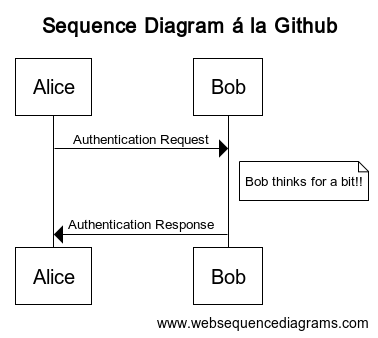

# Sequences
This repo is basically a README.md file (this) and a github Action.
When you commit changes to this repo, the action kicks off and checks
to see if changes have been made to any .txt files. If they have then
for each changed file the data is POSTed to www.websequencediagrams.com
for processing and a png is returned under the same path but with a .png
extension. Additionally the README is updated to display all .pngs in the repo.

# Repo Images
<!-- diagrams:start -->
Last updated 2025-11-06T21:31:04+00:00  
Updates may take up to 5 minutes to show in Github hosted README.md  

<!-- diagrams:end -->
